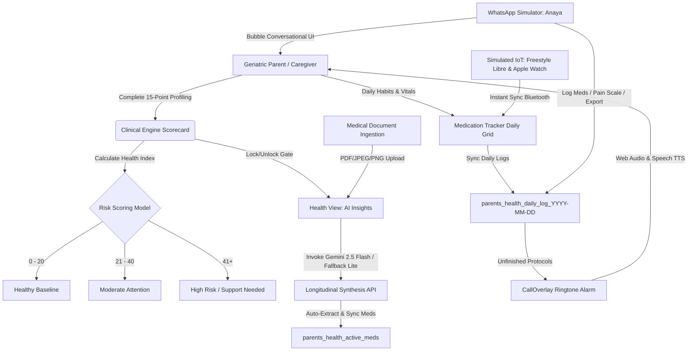

# Parents Health OS: The Definitive Product Architecture, Strategy, & Replication Manual
**Version:** 5.0 (The Unified Production-Grade Reference Authority)  
**Status:** Approved for Production Deployment & Replication  
**Principal Architect:** Tharun Gajula  
**Last Updated:** May 25, 2026

---

## Product Identity & Directory

*   **Official Product Name:** Parents Health OS
*   **Product Category:** Parent health coordination, care simulation, family health operations, and AI-assisted caregiver support system
*   **AI Care Assistant Persona:** Anaya
*   **Founder & Principal Architect:** Tharun Gajula
*   **Local Project Folder:** `parents-health-os`
*   **GitHub Repository:** [https://github.com/tharungajula2/parents-health-os](https://github.com/tharungajula2/parents-health-os)
*   **Vercel Production Deployment:** [https://parents-health-os.vercel.app/](https://parents-health-os.vercel.app/)
*   **Deployment Status:** Completed on Vercel
*   **Current Stage:** Production-deployed MVP / Phase-ready foundation
*   **Product Purpose:** A family-first health coordination operating system to help adult children and families organize, understand, simulate, and manage parent health workflows with privacy-conscious AI assistance.

---

## Executive Product Summary

**Parents Health OS** is a context-aware health coordination platform designed to help families manage parent care more intelligently. It combines holistic health profiles, daily compliance checklists, dry-run vital synchronization, clinical wearable integration models, and secure data handling principles under a single intuitive framework.

At the core of the experience is **Anaya**, a conversational AI care assistant persona. Anaya acts as the dashboard's cognitive brain—translating complex medical jargon into user-friendly definitions, helping users analyze diagnostic reports, synthesizing historical health records, generating clinical briefing documents for physical doctor consultations, and simulating interactive check-in notifications via a simulated WhatsApp gateway.

Rather than acting as a simple AI chatbot wrapper, Parents Health OS acts as a full-fledged operating system designed specifically for the unique family dynamics of eldercare in India.

---

## Product Naming & Reference Clarification

To keep operational documentation and technical architecture consistent:
*   **"Parents Health OS"** refers to the entire product and dashboard platform.
*   **"Anaya"** refers specifically to the conversational AI care companion and analytical persona embedded within the platform.
*   **`parents-health-os`** is the exact repository and system directory name.
*   **`PRODUCT_MASTER_GUIDE.md`** serves as the single-stop living product reference manual for development architecture, strategic planning, and verification.

---

> [!IMPORTANT]
> This application implements a local-first browser storage model for personal data by default in the sandbox environment. Optional AI report analysis uses the configured Gemini API, so uploaded report contents are transmitted to the AI processing service. For production, the roadmap plans a transition to India-residency Supabase storage (`ap-south-1` Mumbai) aligned with India's **DPDPA 2023** and **DPDP Rules 2025** guidelines. All personal health identifiers (PHIs), clinical scores, medical document analysis summaries, and daily habit logs are stored in the client browser's local storage (`localStorage`) by default, or secure database buckets when synced. No central tracking pixels or third-party analytical pipelines are permitted to capture patient records.

---

## Technical Concept Blueprint



---

## 1. Core Philosophy, Strategic Moat, and Target User

### 1.1 Executive Identity & Market Wedge
**Parents Health OS** is a premium, family-shared eldercare oversight platform. The core strategic wedge is simple but extremely powerful:
*   **Build the product as a WhatsApp-first daughter/son dashboard, NOT as a "senior app".** Top Indian players like Khyaal, Emoha, Anvayaa, and Samarth have proven that 60–75-year-old Indian parents resist installing yet another application. The high-conversion solution is a Hindi/Telugu WhatsApp care companion bot for the parent, a Next.js web/mobile dashboard for the 25–45-year-old adult child, and Google Gemini 2.5 Flash as the translation, transcription, and summarization brain.
*   **Parents Health OS** offers an emotionally warm, premium brand voice without being overly clinical, serving as a supportive care system.

### 1.2 The Longitudinal Synthesis Layer
Clinical health data only becomes actionable when synthesized with daily, personal routine context. Standard medical dashboards isolate data. They display a blood sugar reading of `160 mg/dL` and flag it as a generic "High Alert," causing unnecessary anxiety. 

Parents Health OS's **Longitudinal Synthesis Layer** cross-references this reading against geriatric profile variables (e.g., a 76-year-old with a high risk of hypoglycemia and balance instability). It understands that for this specific patient, a higher glycemic floor is a deliberate, protective clinical target to prevent sudden syncopes (fainting) and catastrophic falls. The system correlates high-frequency, noisy daily habit logs (medications, water intake, sleep quality, physical activity) with low-frequency, high-validity clinical artifacts (laboratory reports, doctor prescriptions, radiology scans), building an ongoing digital narrative.

### 1.3 The "Sanskaar-UX" Framework
Targeting Indian seniors requires extreme sensitivity to technological friction. Standard UI designs are too clinical, cold, and demanding. Parents Health OS defines the **"Sanskaar-UX" Framework**:
*   **Warm Companion Persona (Anaya):** Uses culturally resonant greetings and speaks in simple, respectful tones. The senior whom we care for is referred to as "Nani" or "Pitaji", while the virtual care companion assistant is named **Anaya**.
*   **Empathetic Explanations (ELI5):** Translates dense clinical jargon into simple, reassuring descriptions in brackets (e.g., *"Creatinine [a natural kidney waste filter level] is stable"*).
*   **Pavlovian Care Loops:** Leverages scheduled automated reminder triggers linked to natural domestic routines (07:00 Morning Tea, 13:00 Lunch, 21:00 Dinner).

### 1.4 North Star Metric: Routine Synchronization Index (RSI)
Rather than tracking raw daily active users or screen engagement, RSI measures the variance between the **Prescribed Clinical Protocol** (medication frequency, vitals thresholds) and the **Actual Daily Logged Adherence**. A higher RSI indicates a more unified, synchronized care timeline.

---

## 2. Complete 15-Point Geriatric Scorecard Database

The **Clinical Assessment Engine** (implemented at `src/components/ClinicalEngine.tsx`) is the foundation of the patient's digital profile. The developer must implement this exact 15-question scorecard without changing any weights or identifiers, as downstream AI prompts and UI state gates rely on these specific records.

### 2.1 The Assessment Protocol Dictionary
The system assesses 10 distinct physiological and environmental categories, accumulating to a maximum possible health index of **175 points**.

| Question ID | Mapped Category | Assessment Question | Option Weights & Score Mapping |
| :--- | :--- | :--- | :--- |
| **q1** | Resilience | How old is the member? | <ul><li>"Below 40" &rarr; **0**</li><li>"40-55" &rarr; **5**</li><li>"56-69" &rarr; **10**</li><li>"70+" &rarr; **15**</li><li>"Don't Know" &rarr; **5**</li></ul> |
| **q2** | Metabolic | Have they been told they have high blood sugar, prediabetes, or diabetes? | <ul><li>"No" &rarr; **0**</li><li>"Prediabetes" &rarr; **5**</li><li>"Diabetes" &rarr; **15**</li><li>"Don't Know" &rarr; **5**</li></ul> |
| **q3** | Cardiovascular | Do they have high BP, Disturbed Cholesterol, or heart issues (stent, bypass, angina)? | <ul><li>"No" &rarr; **0**</li><li>"One Condition" &rarr; **5**</li><li>"Multiple/Severe" &rarr; **15**</li><li>"Don't Know" &rarr; **5**</li></ul> |
| **q4** | Resilience | Do they get tired or breathless doing everyday activities? | <ul><li>"Never" &rarr; **0**</li><li>"Sometimes" &rarr; **5**</li><li>"Often" &rarr; **10**</li><li>"Don't Know" &rarr; **5**</li></ul> |
| **q5** | Cognitive | Have they had stroke, tremors (parkinsonism), limb weakness, or slowed movements? | <ul><li>"No" &rarr; **0**</li><li>"Mild signs" &rarr; **5**</li><li>"Diagnosed/Visible" &rarr; **10**</li><li>"Don't Know" &rarr; **5**</li></ul> |
| **q6** | Cognitive | Do they often seem confused, forgetful, or unsteady? | <ul><li>"No" &rarr; **0**</li><li>"Sometimes" &rarr; **5**</li><li>"Often" &rarr; **10**</li><li>"Don't Know" &rarr; **5**</li></ul> |
| **q7** | Resilience | Have they been hospitalized or undergone major surgery (heart, brain, spine) or cancer? | <ul><li>"No" &rarr; **0**</li><li>"Once/Minor" &rarr; **5**</li><li>"Multiple/Major/Cancer" &rarr; **10**</li><li>"Don't Know" &rarr; **5**</li></ul> |
| **q8** | Muscular | Do they complain of joint/back/knee pain that limits movement? | <ul><li>"No" &rarr; **0**</li><li>"Sometimes/Mild" &rarr; **10**</li><li>"Severe/Daily" &rarr; **20**</li></ul> |
| **q9** | Frailty | Have they had falls or fractures in the last 2 years? | <ul><li>"No" &rarr; **0**</li><li>"Once" &rarr; **5**</li><li>"Multiple" &rarr; **10**</li><li>"Don't Know" &rarr; **5**</li></ul> |
| **q10** | Frailty | Do they need help with stairs, bathing, dressing or getting off the floor? | <ul><li>"No" &rarr; **0**</li><li>"Occasionally" &rarr; **5**</li><li>"Often" &rarr; **10**</li><li>"Don't Know" &rarr; **5**</li></ul> |
| **q11** | Digestive | Do they complain of bloating, acidity, constipation, or gut issues? | <ul><li>"No" &rarr; **0**</li><li>"Occasionally" &rarr; **5**</li><li>"Frequently" &rarr; **10**</li><li>"Don't Know" &rarr; **5**</li></ul> |
| **q12** | Emotional | Do they often seem stressed, anxious, or emotionally low? | <ul><li>"No" &rarr; **0**</li><li>"Sometimes" &rarr; **5**</li><li>"Often" &rarr; **10**</li><li>"Don't Know" &rarr; **5**</li></ul> |
| **q13** | Sleep | Do they sleep poorly, snore loudly or nap excessively? | <ul><li>"Good/No" &rarr; **0**</li><li>"Sometimes" &rarr; **5**</li><li>"Often/Poor" &rarr; **10**</li><li>"Don't Know" &rarr; **5**</li></ul> |
| **q14** | Lifestyle | Do they usually eat unhealthy foods, eat at odd times, or drink too little water? | <ul><li>"No" &rarr; **0**</li><li>"Sometimes" &rarr; **5**</li><li>"Often" &rarr; **10**</li><li>"Don't Know" &rarr; **5**</li></ul> |
| **q15** | Lifestyle | Do they smoke, drink often or avoid exercise completely? | <ul><li>"None" &rarr; **0**</li><li>"One habit" &rarr; **5**</li><li>"Two or more" &rarr; **10**</li><li>"Don't Know" &rarr; **5**</li></ul> |

### 2.2 Category Score Aggregation Formulas
Each answered question contributes a score that maps into specific categories. The scoring parameters are computed dynamically using `useMemo`:

```typescript
const scores = useMemo(() => {
    const getScore = (qId: string) => {
        const selectedLabel = answers[qId];
        if (!selectedLabel) return 0;
        const question = QUESTIONS.find(q => q.id === qId);
        const option = question?.options.find(opt => opt.label === selectedLabel);
        return option?.score || 0;
    };

    const categories = [
        { name: "Metabolic",      score: getScore("q2"), max: 15 },
        { name: "Cardiovascular", score: getScore("q3"), max: 15 },
        { name: "Cognitive",      score: getScore("q5") + getScore("q6"), max: 20 },
        { name: "Muscular",       score: getScore("q8"), max: 20 },
        { name: "Frailty",        score: getScore("q9") + getScore("q10"), max: 20 },
        { name: "Digestive",      score: getScore("q11"), max: 10 },
        { name: "Emotional",      score: getScore("q12"), max: 10 },
        { name: "Sleep",          score: getScore("q13"), max: 10 },
        { name: "Lifestyle",      score: getScore("q14") + getScore("q15"), max: 20 },
        { name: "Resilience",     score: getScore("q1") + getScore("q4") + getScore("q7"), max: 35 },
    ];

    const total = categories.reduce((sum, cat) => sum + cat.score, 0);

    // Classification Rules
    let riskLevel = "Healthy Baseline";
    if (total > 40) {
        riskLevel = "High Risk: Immediate Action Required";
    } else if (total > 20) {
        riskLevel = "Moderate Attention";
    }

    return { categories, total, riskLevel };
}, [answers]);
```

### 2.3 Score Classifications
*   **0 - 20 (Healthy Baseline):** High baseline resilience. Suggest routine physical monitoring.
*   **21 - 40 (Moderate Attention):** Early signs of functional vulnerability. Recommends a bi-weekly review of lifestyle habits and medication schedules.
*   **41+ (High Risk / Support Needed):** Clear indications of physiological frailty. Unlocks intensive daily care companion logs and triggers reminders if entries are skipped. (LASI baseline statistics note that 32% of Indian elders aged 60+ have diagnosed hypertension, 14% have diabetes, and 19% have chronic bone/joint disease).

---

## 3. WhatsApp Messaging Simulation & Meta Cloud API Onboarding

To support seniors using familiar tools, the messaging hub (`src/components/WhatsAppDemo.tsx`) simulates a live conversation with **Anaya**, the virtual care companion.

### 3.1 WhatsApp Onboarding Flow (Meta Cloud API, Direct)
1.  **Meta Business Manager:** Create a Business Account (`business.facebook.com`). Match legal entity credentials.
2.  **Meta Business Verification:** Upload Certificate of Incorporation or GST certificate.
3.  **WABA Creation:** Choose **INR** as the billing currency at WABA creation (this cannot be changed later).
4.  **Phone Number Registration:** Register a new number not associated with a personal WhatsApp account.
5.  **Access Token:** Generate a permanent System User access token and store in Vercel environment variables.
6.  **Webhook Setup:** Point Meta's webhook to `https://your-domain.com/api/wa/webhook`.

### 3.2 Pricing Math (India, INR, 2026 rates)
Meta's billing model operates on per-message category fees:
*   **Service Messages (Customer-Initiated):** **Free** within a 24-hour response window.
*   **Utility Templates (Reminders, Summaries):** **~₹0.115–₹0.13** per delivered message.
*   **Authentication Templates (OTPs):** **~₹0.115–₹0.13** per message.
*   **Marketing Templates (Promo/New features):** **~₹0.86–₹0.88** per message (Meta increased Indian marketing message rates by 10% on Jan 1, 2026).

**Estimated Monthly WhatsApp Cost for 100 Families:**
*   100 parents × 5 daily utility messages × 30 days = 15,000 messages.
*   Since the majority of parents respond within the 24-hour service window, billable templates average 4,000–6,000/month.
*   4,000 × ₹0.13 = ₹520 + GST = **~₹700–₹2,500/month** total operating cost.

### 3.3 Interactive Dialog Flow
*   **Incoming Voice Notes:** WhatsApp Cloud API webhook delivers a `media.id`. Fetch via `GET /v18.0/{media-id}`, download the Presigned URL, and feed the binary bytes (`audio/ogg; codecs=opus`) to Gemini 2.5 Flash for transcription and translation.
*   **Outgoing Voice Notes:** Upload native synthesized Speech TTS audio (`audio/ogg`) to Meta media endpoints, then dispatch as `{ type: "audio", audio: { id } }` to render with clean play/pause wave controls.
*   **Actionable Templates:**
    *   *Reminders:* "Namaste Ji, {{1}} ki goli ka samay ho gaya hai. Le li ho toh niche tap karein."
    *   *Quick Replies:* [Taken ✅] | [Snooze 30m ⏰]
    *   *Contextual Triggers:* Tapping "Taken ✅" records medication completion, updates client memory, and triggers the follow-up pain tracking loop: *"How is your knee pain today on a scale of 1-10?"*

---

## 4. The Longitudinal Synthesis API & Fallback Routing

To synthesize clinical contexts and analyze documents, Parents Health OS routes requests to a single dynamic Next.js API endpoint: `/api/analyze/route.ts`. The implementation supports two processing workflows: **Holistic Summary Synthesis** and **Multimodal Document Analysis**, with a robust automated model fallback.

### 4.1 Next.js API Route Architecture (`src/app/api/analyze/route.ts`)
```typescript
import { GoogleGenerativeAI } from "@google/generative-ai";
import { NextResponse } from "next/server";

const genAI = new GoogleGenerativeAI(process.env.NEXT_PUBLIC_GEMINI_API_KEY || "");

export const maxDuration = 60; // Max execution time for API functions
export const dynamic = 'force-dynamic';

export async function POST(req: Request) {
  try {
    const formData = await req.formData();
    const file = formData.get("file") as File;
    const clinicalContext = formData.get("clinicalContext") as string || "No clinical profile available.";
    const historyContext = formData.get("historyContext") as string || "No previous reports.";
    const mode = formData.get("mode") as string;

    // ==========================================
    // WORKFLOW 1: HOLISTIC SUMMARY SYNTHESIS
    // ==========================================
    if (mode === "summary") {
       let modelString = "gemini-2.5-flash"; 
       let model = genAI.getGenerativeModel({ model: modelString });
       
       const summaryPrompt = `You are "Parents Health AI" (Anaya's Dashboard Brain), a senior medical data analyst.
       
       OBJECTIVE: Generate a "Holistic Health Summary" for an Indian elder based on their Clinical Profile and Report History.
       
       TONE: 
       - Beginner Friendly (Explain simple medical terms in brackets).
       - Reassuring but Objective.
       - Use Simple English (ELI5 style).
       
       INPUTS:
       1. Clinical Profile (Assessment Scores & Answers):
       ${clinicalContext}
       
       2. Report History (Past Lab/Rx Analysis):
       ${historyContext}
       
       TASKS:
       1. **Synthesize:** Combine the clinical profile risks with findings from the report history.
       2. **Filter Noise:** Ignore reports that seem completely unrelated.
       3. **Connect the Dots:** Highlight how reports confirm or contradict clinical assessment scores.
       
       OUTPUT FORMAT (JSON):
       \`\`\`json
       {
         "title": "Holistic Health Summary",
         "patientRiskProfile": "Summary of their risk level (e.g. 'High Risk Diabetic')",
         "keyFindings": [
           "**Finding 1**: Explanation in simple english.",
           "**Finding 2**: Another finding."
         ],
         "trendAnalysis": "A nicely spaced paragraph describing the health trajectory. Use bold text for emphasis.",
         "recommendation": "One clear, high-level medical recommendation based on the synthesis."
       }
       \`\`\`
       `;

       let result;
       try {
           result = await model.generateContent(summaryPrompt);
       } catch (error: any) {
           console.warn(`Summary with ${modelString} failed: ${error.message}. Fallback to gemini-2.5-flash-lite.`);
           modelString = "gemini-2.5-flash-lite";
           model = genAI.getGenerativeModel({ model: modelString });
           result = await model.generateContent(summaryPrompt);
       }

       const text = result.response.text();
       let jsonString = cleanJsonResponse(text);
       
       try {
           return NextResponse.json({ result: JSON.parse(jsonString), modelUsed: modelString });
       } catch (e) {
           return NextResponse.json({ error: "Failed to parse Summary JSON", raw: text }, { status: 500 });
       }
    }

    // ==========================================
    // WORKFLOW 2: MULTIMODAL DOCUMENT ANALYSIS
    // ==========================================
    if (!file) {
      return NextResponse.json({ error: "No file provided" }, { status: 400 });
    }

    const arrayBuffer = await file.arrayBuffer();
    const buffer = Buffer.from(arrayBuffer);
    const base64Data = buffer.toString("base64");
    const mimeType = file.type || "image/png";

    let modelString = "gemini-2.5-flash"; 
    let model = genAI.getGenerativeModel({ model: modelString });

    const prompt = `You are "Parents Health AI" (Anaya's Multimodal Brain), an automated health data analyst.
    Your Tone: Empathetic, Reassuring, Beginner-Friendly (Explain medical terms in brackets).
    
    Patient Clinical Context (Profile):
    ${clinicalContext}

    Medical History (Past Reports Summary):
    ${historyContext}

    TASKS:
    1.  **Classify:** Is this a "Lab Report", "Prescription", or "Scan"?
    2.  **Analyze (Deep Read):** Read every single page. Extract all abnormal values.
    3.  **Explain:** For every abnormal finding, explain WHAT it means in simple English.
    4.  **Medicines:** Extract detailed medicine info.
        -   **Type:** "Chronic" (Long-term) OR "Acute" (Short-term).
        -   **Duration:** Look for keywords like "for 5 days", "1 month". Default to "Ongoing" if Chronic.
    5.  **Context:** Connect findings to the Patient Clinical Profile.
    
    CRITICAL: Output must be in strict JSON format.
    
    \`\`\`json
    {
      "meta": { "reportDate": "YYYY-MM-DD", "reportType": "Lab/Rx/Scan", "pageCount": "estimated pages" },
      "summary": "High-level summary in simple, non-jargon language.",
      "clinicalCorrelation": "How this report relates to the patient's history (e.g. 'This confirms the diabetes risk').",
      "biomarkers": [
          { "name": "Test Name", "value": "120", "unit": "mg/dL", "status": "High/Low/Normal", "trend": "Rising/Falling/Stable/New" }
      ],
      "analysis": "Detailed findings in MARKDOWN. Use bullet points, **Bold** text, and short paragraphs. Explain complex terms.",
      "medicines": [ 
        { 
          "name": "Augmentin 625", 
          "type": "Acute", 
          "strength": "625mg", 
          "dosage": "1 tablet twice daily", 
          "timing": "After food",
          "duration": "5 days"
        },
        { 
          "name": "Glycomet", 
          "type": "Chronic", 
          "strength": "500mg", 
          "dosage": "1 tablet daily", 
          "timing": "Before food",
          "duration": "Ongoing"
        } 
      ],
      "disclaimer": "Generated by AI. Verify with a specialist."
    }
    \`\`\`
    `;

    const analyzeImage = async (selectedModel: any) => {
        return await selectedModel.generateContent([
            prompt,
            {
              inlineData: {
                data: base64Data,
                mimeType: mimeType,
              },
            },
        ]);
    };

    let result;
    try {
        result = await analyzeImage(model);
    } catch (modelError: any) {
        console.warn(`Primary model ${modelString} failed (${modelError.message}), fallback to gemini-2.5-flash-lite`);
        modelString = "gemini-2.5-flash-lite";
        model = genAI.getGenerativeModel({ model: modelString });
        result = await analyzeImage(model);
    }

    const responseText = result.response.text();
    let jsonString = cleanJsonResponse(responseText);
    
    let parsedResult;
    try {
        parsedResult = JSON.parse(jsonString);
    } catch (e) {
        console.error("Failed to parse JSON from AI", responseText);
        try {
            const sanitized = jsonString.replace(/\n/g, "\\n");
            parsedResult = JSON.parse(sanitized);
        } catch (e2) {
             parsedResult = {
                docType: "Unknown",
                summary: "Analysis completed but format was unstructured.",
                analysis: responseText,
                medicines: [],
                disclaimer: "AI Parsing Error. Raw output shown."
            };
        }
    }

    return NextResponse.json({ result: parsedResult, modelUsed: modelString });

  } catch (error: any) {
    console.error("Parents Health AI Analysis Error:", error);
    return NextResponse.json({ error: "Failed to analyze the report.", details: error.message || String(error) }, { status: 500 });
  }
}

function cleanJsonResponse(text: string): string {
    const codeBlockMatch = /```(?:json)?\s*([\s\S]*?)\s*```/i.exec(text);
    if (codeBlockMatch) {
        return codeBlockMatch[1];
    }
    const firstBrace = text.indexOf('{');
    const lastBrace = text.lastIndexOf('}');
    if (firstBrace !== -1 && lastBrace !== -1) {
        return text.substring(firstBrace, lastBrace + 1);
    }
    return text;
}
```

### 4.2 Automated Fallback Routing
*   **Primary Engine:** `gemini-2.5-flash` handles standard ingestion. It features deep multilingual alignment, multimodal capabilities, and a 1M token context.
*   **Secondary Engine:** `gemini-2.5-flash-lite`. Operates as the robust fallback model for immediate failover during rate limits.
*   **PII Directive:** For unpaid prototype/free-tier accounts, all parent PII must be stripped client-side prior to Gemini transmission. Pinned billing paid Tier 1 accounts do not use inputs for model training, satisfying enterprise privacy guidelines.

---

## 5. Daily Care Routine, Checklist, and Simulated IoT

### 5.1 Adherence Checklist Engine
Located in `src/components/MedicationTracker.tsx`, the daily checklist tracks logs in real-time, mapping medications against scheduled hours:
```typescript
const toggleMed = (medName: string) => {
    const isTaken = activeLog.meds.includes(medName);
    let newMedsList = isTaken
        ? activeLog.meds.filter(m => m !== medName)
        : [...activeLog.meds, medName];
    
    const newLog = { ...activeLog, meds: newMedsList };
    saveLog(viewingDate, newLog);
};
```

### 5.2 History Calendar Matrix
Renders a grid mapping monthly compliance:
*   **Green Circle/Surface (`bg-cyan-500/20 text-cyan-400`):** Perfect adherence. All active medications are checked, and vitals are logged.
*   **Amber Circle/Surface (`bg-amber-500/20 text-amber-400`):** Partial completion. Some entries or vitals are missing.
*   **Red Circle/Surface (`bg-red-500/10 text-red-500`):** Incomplete log. Nothing recorded.

### 5.3 Simulated Bluetooth IoT Core
Simplifies elder inputs via mocked Bluetooth device connections:
*   **FreeStyle Libre 3 (CGM):** Simulates standard reading sync, outputting a safe metabolic level of **110 mg/dL** directly to dashboard states. Displays a toast notification: `⚡ Synced 110 mg/dL from Freestyle Libre`.
*   **Apple Watch Ultra 2:** Automatically syncs a weight of **64.5 kg** and logs **45 minutes** of active exercise, displaying a blue confirmation toast.
*   **Omron X7 Smart BP Monitor:** Setup as a mock pairing placeholder card with a dashed border to denote future integration.

---

## 6. Web Audio Ringtone Oscillator System

When compliance runs past threshold times, the call overlay module (`src/components/CallOverlay.tsx`) activates, utilizing the browser's native Web Audio API to trigger a high-frequency acoustic alert without relying on external file assets.

### 6.1 Web Audio Dual-Tone Oscillator
```typescript
const playRingtone = () => {
    if (!audioCtxRef.current) {
        audioCtxRef.current = new (window.AudioContext || (window as any).webkitAudioContext)();
    }
    const ctx = audioCtxRef.current;
    const osc = ctx.createOscillator();
    const gain = ctx.createGain();

    osc.type = "sine";
    // Dual-tone high-priority shift
    osc.frequency.setValueAtTime(440, ctx.currentTime); 
    osc.frequency.setValueAtTime(554.37, ctx.currentTime + 0.2); 

    // Pulse Envelope configurations
    gain.gain.setValueAtTime(0, ctx.currentTime);
    gain.gain.linearRampToValueAtTime(0.5, ctx.currentTime + 0.1);
    gain.gain.linearRampToValueAtTime(0, ctx.currentTime + 0.4);
    gain.gain.setValueAtTime(0, ctx.currentTime + 0.6);
    gain.gain.linearRampToValueAtTime(0.5, ctx.currentTime + 0.7);
    gain.gain.linearRampToValueAtTime(0, ctx.currentTime + 1.0);

    osc.connect(gain);
    gain.connect(ctx.destination);

    osc.start();
    oscillatorRef.current = osc;
};
```

### 6.2 SpeechSynthesis Voice TTS
Upon call pick-up, the ringtone halts, and the browser's TTS system delivers an automated companion nudge:
*   **Message:** `"Namaste. Please take your scheduled medicines."`
*   **Speech Velocity:** Set to `0.9` (slowed down for clear comprehension).
*   **Automatic Transition:** Timed for 5 seconds of active duration before returning the senior back to the dashboard layout.

---

## 7. Clinical Operations & Support Infrastructure

### 7.1 Financial Transactions: Praan Wallet
Mock transactional engine positioned at `src/components/ClinicHub.tsx`:
*   **Initial Balance:** Initialized at ₹1,250.
*   **Actionable Logs:** Simulates deducting credits to schedule teleconsultation sessions with specialized geriatric care professionals.

### 7.2 Insurance Coverage: Senior Shield
Standard coverage policy representation:
*   **Policy ID:** `YUK-8829-X`.
*   **Visual Interface:** Explains co-pays, deductibles, and supported clinical facilities.

### 7.3 Multi-Channel Care Team Specialist Guild
1.  **Anaya:** Virtual care companion assistant.
2.  **Dr. Aruna Desai (Geriatric Specialist):** Oversees medical reviews and checks weekly pain logs.
3.  **Ms. Sanya Kapoor (Dietitian):** Focuses on low-glycemic, cardiac-healthy diets.
4.  **Coach Vikram Singh (Physiotherapist):** Mobility routines and fall-prevention exercises.
5.  **Amit Verma (Support Ops):** Logistics coordinator.
6.  **Dr. Esha Sethi (Sleep Practitioner):** Nighttime breathing profiles and sleep quality tracking.

---

## 8. Client-Side Local Storage Schema Registry

| Local Storage Key | Data Type | Default Value | JSON Schema / Data Shape Example |
| :--- | :--- | :--- | :--- |
| `parents_health_auth_v2` | `boolean` | `true` | `true` |
| `parents_health_user_name` | `string` | `"Nani"` | `"Nani"` (Refers to the parent; the assistant is named Anaya) |
| `parents_health_assessment_data_v2` | `object` | `null` | ```json<br>{<br>  "answers": {<br>    "q1": "70+",<br>    "q2": "Diabetes"<br>  },<br>  "scores": {<br>    "total": 30,<br>    "riskLevel": "Moderate Attention"<br>  }<br>}<br>``` |
| `parents_health_active_meds` | `array` | `[]` | ```json<br>[<br>  {<br>    "name": "Glycomet",<br>    "dosage": "500mg",<br>    "timing": "After Food",<br>    "type": "Chronic",<br>    "status": "Active",<br>    "startDate": "2026-04-17"<br>  }<br>]<br>``` |
| `parents_health_history` | `array` | `[]` | ```json<br>[<br>  {<br>    "meta": {<br>      "reportDate": "2026-04-17",<br>      "reportType": "Lab Report"<br>    },<br>    "summary": "Blood sugar has stabilized.",<br>    "biomarkers": [<br>      { "name": "HbA1c", "value": "6.8", "status": "Normal" }<br>    ],<br>    "analysis": "Markdown analysis text..."<br>  }<br>]<br>``` |
| `parents_health_latest_summary` | `object` | `null` | ```json<br>{<br>  "title": "Holistic Health Summary",<br>  "patientRiskProfile": "Moderate Attention Diabetic",<br>  "keyFindings": ["Finding 1"],<br>  "trendAnalysis": "Trajectory text...",<br>  "recommendation": "Recommendation text..."<br>}<br>``` |
| `parents_health_daily_log_YYYY-MM-DD` | `object` | `null` | ```json<br>{<br>  "meds": ["Glycomet"],<br>  "vitals": {<br>    "bpSys": 120,<br>    "bpDia": 80,<br>    "sugar": 110,<br>    "weight": 64.5<br>  },<br>  "habits": {<br>    "mealPlan": true,<br>    "activity": 45,<br>    "hydration": 8<br>  }<br>}<br>``` |

---

## 9. Design System: Calming Warm Healthcare Theme

To deliver an exceptional visual style, the user interface shifts away from cold, dark tech HUD elements toward a premium, warm clinical aesthetic suitable for Indian families.

### 9.1 Foundational Variables (`src/app/globals.css`)
*   **Off-White Cream Background:** `#FAF9F6`
*   **Primary Text (Forest Charcoal):** `#122321`
*   **Primary Accent (Deep Trust Teal):** `#0E5E5A`
*   **Highlight Accent (Warm Amber / Saffron):** `#E05E1B`

### 9.2 Tailwind Color Mapping Override
In Tailwind configurations, default styles are mapped directly using the `@theme` directive inside `src/app/globals.css`:
```css
@theme {
  --color-slate-950: #FAF9F6;
  --color-slate-900: #122321;
  --color-slate-800: #1c3330;
  --color-cyan-400: #E05E1B;
  --color-cyan-500: #0E5E5A;
  --color-cyan-600: #0C4E4B;
}
```

### 9.3 Custom Glassmorphic Cards & Controls
```css
.glass-card {
  background: #ffffff !important;
  backdrop-filter: blur(8px) !important;
  border: 1px solid #e2ded5 !important;
  box-shadow: 0 10px 30px rgba(18, 35, 33, 0.03) !important;
}

input, textarea, select {
  background-color: #FAF9F6 !important;
  border: 1px solid #e2ded5 !important;
  color: #122321 !important;
}

input:focus, textarea:focus, select:focus {
  border-color: #0E5E5A !important;
  box-shadow: 0 0 0 2px rgba(14, 94, 90, 0.1) !important;
}

/* Syntactically valid escaped class names for Next.js/Tailwind compiler */
.bg-\[\#0E5E5A\] .text-white,
.bg-\[\#E05E1B\] .text-white {
  color: #ffffff !important;
}
```

### 9.4 Visual QA & Production Design Stabilization Pass (May 2026)
During the conversion from a dark-themed tech prototype to the premium, high-contrast warm clinical theme, several visual QA corrections were implemented to eliminate overlapping text, white-on-white text clipping, and misaligned panels:
1. **Dynamic Theme Overrides:** Old `bg-slate-950` and `bg-slate-900` styles from the dark-themed skeleton were globally mapped to high-contrast `#ffffff` and `#FAF9F6` backgrounds. Any text element matching these containers was forced to deep forest charcoal (`#122321`) to maintain perfect WCAG accessibility levels.
2. **Profile & Notification Overlays:** Standardized the Header widgets. Interactive dropdown menus (such as user profiles and system notifications) are styled with explicit light card backgrounds, rich `#122321` text labels, and clean `#e2ded5` borders to prevent overlapping icons.
3. **Modal Form Refactoring:** In components like `ClinicHub.tsx`, hardcoded overlay overrides are avoided by utilizing a distinct `bg-black/65` backdrop, while form cards are styled as explicit light panels (`bg-white`) containing soft input backgrounds (`bg-slate-50`), deep charcoal text, and brand-aligned forest teal (`#0E5E5A`) accents.
4. **Cohesive Color Accents:** Unified clinical status buttons, tracker checklists, active tabs, and specialist badges to render using either deep trust teal (`#0E5E5A`) or saffron amber (`#E05E1B`), achieving a perfect visual rhythm across both mobile and desktop viewports.

---

## 10. Privacy & Compliance — DPDPA 2023 / DPDP Rules 2025

Health records constitute sensitive personal data under India's **DPDPA 2023** and **DPDP Rules 2025** framework. 

### 10.1 Key Directives for Parents Health OS
1.  **Strict Consent Ledger:** Every customer signup must log explicit, granular consent inside the `consents` table (storing timestamp, IP address, consent version, and locale).
2.  **Verifiable Consent:** In cases of severe cognitive impairment (e.g. advanced dementia), the platform requires lawful guardianship documentation to be uploaded, making the child the primary authorized Data Principal.
3.  **Data Residency:** Pin all Supabase instances to India's `ap-south-1` Mumbai region.
4.  **No Bundling:** Keep checkboxes for service delivery, marketing, and AI processing completely separate.
5.  **Right to Erasure:** Typing "STOP" on WhatsApp or clicking "Delete Account" on the dashboard must trigger a soft-deletion within 48 hours and a complete database purge within 30 days.

---

## 11. Foolproof Step-by-Step 90-Day Build & Replication Roadmap

This section outlines the build steps required to replicate this application from scratch.

### Step 1: Initialize Next.js Workspace
Run the setup script inside an empty folder:
```powershell
npx -y create-next-app@latest parents-health-os --typescript --tailwind --app --src-dir --import-alias "@/*" --use-npm
cd parents-health-os
```

### Step 2: Install Core Ingestion Packages
```powershell
npm install @google/generative-ai lucide-react framer-motion react-dropzone react-markdown
```

### Step 3: Write Configuration Files
Initialize a `.env.local` file in the root folder containing:
```env
NEXT_PUBLIC_GEMINI_API_KEY=your_gemini_api_key_here
```

### Step 4: Configure Global Design Overrides
Replace the contents of `src/app/globals.css` with the CSS definitions detailed in **Section 9**.

### Step 5: Implement the Longitudinal Ingestion API
Create the path `src/app/api/analyze/route.ts` and paste the complete route logic detailed in **Section 4.1**.

### Step 6: Assemble Core Components
Recreate the components inside `src/components/` following these layout boundaries:
1.  **Clinical Assessment (`src/components/ClinicalEngine.tsx`):** Map the 15 questions and category parameters from **Section 2**.
2.  **WhatsApp Simulator Chat (`src/components/WhatsAppDemo.tsx`):** Build the dialog chains, pain-tracking nodes, and styling parameters matching **Section 3**.
3.  **Medication Checklists (`src/components/MedicationTracker.tsx`):** Set up daily time slots and hook up Freestyle Libre and Apple Health mock sync toggles from **Section 5**.
4.  **Audio Oscillator Call Ringing (`src/components/CallOverlay.tsx`):** Implement the twin-frequency oscillator loop and custom slowed Speech TTS prompt detailed in **Section 6**.
5.  **Document Upload & OCR parser (`src/components/SmartReport.tsx`):** Set up drag-and-drop zones, handle base64 image encoding, fetch responses from `/api/analyze`, and execute clean medication merges into client storage.

### 90-Day Sprint Calendar Execution (Free-tier to Production Scaling)
*   **Sprint 0 (Week 1):** Buy domains (`parentshealth.in`), set up Meta WABA, verify corporate entity, set up database tables in `ap-south-1`.
*   **Sprint 1-2 (Weeks 2-3):** Build child auth (OTP via WhatsApp template), configure consent ledger tables, and initialize local storage synchronization.
*   **Sprint 3 (Week 4):** Connect Meta webhook to Next.js API, configure webhook media signature checking, and verify message routing.
*   **Sprint 4-5 (Weeks 5-6):** Integrate Gemini Flash transcription, build multilingual TTS voice synthesis templates, and trace token usage costs.
*   **Sprint 6 (Week 7):** Implement progressive Katz ADL and GDS-15 scoring protocols over WhatsApp dialog prompts.
*   **Sprint 7-8 (Weeks 8-9):** Build the minimal doctor workspace for consult reviews and prescription PDF generation.
*   **Sprint 9 (Weeks 10-11):** Launch initial hand-held beta testing with 10 families, monitoring the WhatsApp quality rating.
*   **Sprint 10-12 (Weeks 12-13):** Scale up to 100 families, activate paid tiers for Vercel, Supabase, and Gemini to ensure robust data residency compliance, and begin processing subscriptions.

---

## 12. Investor Demo & Founder Walkthrough Manual

> [!IMPORTANT]
> **CLINICAL AND LEGAL SAFETY WARRANTY**
> Parents Health OS is a caregiver-assistive coordination, summarization, organization, reminder, and health simulation system. **It is NOT a licensed medical software, does not replace professional clinical judgment, and does not provide diagnostic services, clinical treatment, or emergency medical dispatch.** All emergency guidelines and clinical escalations must be directed through physical primary care doctors and emergency ambulance services.

### 12.1 Demo Preparation Checklist
Before initiating a demonstration session for investors, mentors, or clinical advisors, verify the following setup is active:
*   **Active URL:** Open the deployed Vercel production URL ([https://parents-health-os.vercel.app/](https://parents-health-os.vercel.app/)) on both desktop and mobile viewports.
*   **Local Repository Sandbox:** Keep VS Code open locally showing the `parents-health-os` workspace in case the audience requests a technical walkthrough of the local-first security architecture.
*   **TypeScript Verification:** Confirm that `npm run build` is passing with exit code 0 to ensure code compilation integrity.
*   **Data Integrity & Security:** Ensure no actual patient or private clinical records are loaded. Verify that only secure, high-fidelity synthetic profiles (**Amma Demo** and **Papa Demo**) are active inside the Client-side `localStorage`.
*   **Reference Ready:** Keep this `PRODUCT_MASTER_GUIDE.md` open in a browser tab or markdown reader as a strategic anchor.
*   **The Founder's Genesis Story:** Prepare a 1-minute personal narrative highlighting the friction of managing long-distance care for aging parents in India, explaining how standard tools fail elder cognitive barriers.

### 12.2 The 30-Second Product Pitch
> *"Every year, millions of working professionals experience the constant anxiety of managing their aging parents' chronic health conditions from a distance. The seniors resist installing complicated apps, and the caregivers have no visibility into daily compliance. Parents Health OS solves this with a two-way interface: a respectful, zero-friction WhatsApp care companion named Anaya for the parent, and a high-fidelity, context-aware dashboard for the family caregiver. It bridges the communication gap and ensures clinical safety without requiring seniors to learn a single new technology."*

### 12.3 The 2-Minute Product Pitch
*   **The Problem:** Aging parents in India face multiple chronic conditions (hypertension, diabetes, joint pain) requiring careful daily adherence. However, seniors resist clinical-looking apps. They communicate exclusively through WhatsApp. At the same time, their adult children are left completely in the dark regarding medication compliance, vitals variations, or report abnormal values.
*   **The Target Users:**
    1.  *Primary Caregivers:* 25–45 year old working professionals (often living in high-tier Indian cities or NRI zones) who manage parent health budgets.
    2.  *Seniors:* 60–80+ year old parents who use simple smartphones and prefer local-language messaging.
*   **The Solution:** Parents Health OS represents a specialized coordination layer. It operates on a "Sanskaar-UX" philosophy—warm, respectful, and culturally resonant.
*   **Anaya Care Assistant:** Rather than a simple prompt wrapper, Anaya represents the cognitive intelligence layer. Anaya monitors vitals, translates clinical reports (e.g., explaining creatinine or HbA1c in simple terms), and manages scheduled daily medication checklists.
*   **Privacy-First Direction:** Designed in alignment with India's DPDP Act 2023 principles. By defaulting to a local-first browser storage architecture in the sandbox, we demonstrate absolute user trust before planned migrations to residency-locked regional databases in production.
*   **Future Vision:** Scale from a high-fidelity simulation model into a national integration layer connected directly to clinical laboratories, wearable telemetry, and professional geriatric care providers.

### 12.4 End-to-End Demo Journey


1.  **Start at the Dashboard:** Introduce the elegant, calming, warm healthcare aesthetic designed to evoke trust rather than medical coldness.
2.  **Explain the Dual-Profile Isolation:** Show how clicking the Parent Switcher instantly swaps the active dashboard state between "Amma Demo" and "Papa Demo" using dynamic client-side state.
3.  **Demonstrate the Geriatric Assessment Wizard:** Navigate to the Onboarding tab to show the 15-question scorecard covering metabolic, frailty, muscular, and emotional pillars. Highlight how this index calibrates alert thresholds.
4.  **Perform Daily Care Logging & Simulated IoT Sync:** Open the tracker checklist. Check off a medication to show immediate ring updates and premium toast indicators. Click **SYNC CGM** or **SYNC SMARTWATCH** to demonstrate how frictionless device telemetry integration is mapped.
5.  **Simulate the WhatsApp Care Companion Dialog:** Open the WhatsApp Demo view. Highlight the mock Meta Cloud API gateway status. Send a simulated BP Measurement template and observe the automatic chat feed response showing Anaya logging compliance.
6.  **Analyze a Medical Document (OCR):** Upload a lab report or trigger the simulated ingest. Show how Anaya extracts abnormal biomarkers and adds them to the historical trajectory chart.
7.  **Generate a Structured Doctor Brief:** Go to the Care Team section, select the "Doctor Brief" tab, and click **Generate Doctor Brief**. Explain how this summarizes complex clinical logs into a highly practical single-page sheet for physical consults.
8.  **Highlight Data Residency & DPDP Act Readiness:** Show the footer security badges. Explain the local-first execution model.
9.  **Conclude with the Future Integration Vision & Investment Value Proposition.**

### 12.5 Section-by-Section Demo Script & Speaking Notes

#### Section A: The Dashboard Home
*   **Action:** Point to the main header and general status tiles. Switch profiles between Amma and Papa.
*   **What to Say:** *"Welcome to the Parents Health OS dashboard. The interface is styled using a calming warm teal and cream palette specifically tailored to reduce anxiety for Indian families. As I switch from Amma to Papa, you will see the entire clinical profile, medication list, and daily progress values swap instantly. This showcases our profile isolation model."*
*   **Investor Question Answered:** *How does a single user coordinate care for multiple parents? Is the system reactive?*
*   **What NOT to Overclaim:** Do not claim that this is pulling from real EHR servers yet; explain that it currently functions in high-fidelity Sandbox Local Storage mode.

#### Section B: The 15-Point Assessment Engine
*   **Action:** Navigate to the onboarding questionnaire. Point out questions on metabolic risk and frailty.
*   **What to Say:** *"Most apps just ask for age and weight. Parents Health OS computes a comprehensive 15-question Geriatric Scorecard covering metabolic, cognitive, emotional, sleep, muscular, and frailty factors. The resultant score classifies the parent into risk profiles—Healthy, Moderate, or High. High-risk profiles automatically trigger more intensive care companion loops."*
*   **Investor Question Answered:** *How does the system understand clinical baseline context beyond simple manual inputs?*
*   **What NOT to Overclaim:** Do not say this replaces professional geriatric triage; it serves as a coordination baseline.

#### Section C: Wearable IoT & Daily Logs
*   **Action:** Toggle medication checklist tasks. Click **SYNC CGM** and **SYNC SMARTWATCH**.
*   **What to Say:** *"We simplify daily health telemetry. When the parent checks off a morning medication, the adult child gets real-time visibility. By clicking our mock Freestyle Libre sync, blood sugar levels populate automatically. Smartwatch syncing captures activity and weight instantly, eliminating double data entry."*
*   **Investor Question Answered:** *How do we overcome manual vitals typing fatigue?*
*   **What NOT to Overclaim:** Do not state that the app is FDA/CE cleared as a primary diagnostic device.

#### Section D: Simulated WhatsApp Interface
*   **Action:** Open the WhatsApp Gateway Demo page, select "BP Measurement Request," click "Dispatch Template," and view the simulated chat feed.
*   **What to Say:** *"Top Indian eldercare startups face a massive challenge: seniors do not like downloading apps. Our strategy is simple—bring the app to where they already are. Here we simulate Anaya dispatching respectful Hindi/English medication and vital reminders. The parent replies directly on WhatsApp, and Anaya automatically parses the text, logs the vitals to our local state, and alerts the caregiver if thresholds are breached."*
*   **Investor Question Answered:** *How do you solve user retention and friction for seniors?*
*   **What NOT to Overclaim:** State clearly that while the current UI runs in sandbox mode, the backend routing is designed to map directly to Meta's Cloud API endpoints.

#### Section E: Smart Ingestion & The Doctor Brief
*   **Action:** Trigger report analysis, then open the Doctor Brief page. Show the "Print / Export" option.
*   **What to Say:** *"Diagnostic labs deliver dense PDFs that cause immense caregiver stress. Parents Health OS extracts biomarkers using Google Gemini 2.5 Flash, explaining medical terms in simple language inside brackets. More importantly, we synthesize these reports with daily log compliance to generate a concise, print-ready 'Doctor Brief'. When the parent visits their physical doctor, they present a single-page timeline that optimizes consult efficiency."*
*   **Investor Question Answered:** *How does AI add value beyond generic chatbot interfaces?*
*   **What NOT to Overclaim:** Emphasize that the brief is intended for reference during doctor discussions and is not automated medical diagnosis.

### 12.6 Investor Q&A Blueprint

#### Q1: Who is the target customer and who pays for this service?
*   **Answer:** The primary buyer is the adult child (aged 25-45, working professional or NRI) who carries the financial burden and emotional anxiety of parent care. They pay a monthly subscription fee for coordination tools, real-time alert routing, clinical summary pipelines, and direct caregiver integration features.

#### Q2: Why target parent health specifically rather than general family health?
*   **Answer:** Geriatric care represents the most complex care coordination environment. Elders manage multiple chronic diseases (polypharmacy), face severe cognitive and physical barriers, and lack active technical literacy. By specializing in this specific niche, we build deep strategic moats around culturally resonant design principles ("Sanskaar-UX") and DPDPA-compliant India-residency architectures.

#### Q3: What makes Parents Health OS different from a standard ChatGPT custom GPT or health chatbot?
*   **Answer:** Chatbots are transient, stateless interfaces. Parents Health OS is a systematic clinical operating system. It features profile isolation, a structured 15-point assessment scorecard, dynamic historical trajectory charts, a daily compliance checklist, physical IoT sync interfaces, and structured client-side storage keys. Anaya is not just a chat window; it is the cognitive processor overlaying a solid, structured database.

#### Q4: How is patient privacy managed under India's DPDP Act 2023?
*   **Answer:** We implement strict DPDP-aligned design readiness parameters:
    1.  *Consent Ledger Simulation:* Structured tracking of simulated caregiver and parent consent before any simulated data processing.
    2.  *Planned Regional Residency:* The production cloud blueprint plans to pin Supabase database instances strictly to the `ap-south-1` Mumbai region for local data residency.
    3.  *Client-Side Sandbox Default:* For this prototype, all personal profiles, vitals logs, and simulated check-ins are stored in client-side browser localStorage, demonstrating user data sovereignty.

#### Q5: Is the product ready for live hospital integrations?
*   **Answer:** The current build is a high-fidelity Sandbox and operational MVP. The API schema, local storage patterns, and modular React components are fully built to migrate cleanly to live hospital databases and official Meta Business accounts when needed.

---

## 13. Founder Operating Manual

This master manual serves as the single source of truth for Parents Health OS. As the founder and principal architect, you should treat this document as a living artifact that reflects the exact technical and operational state of the product.

### 13.1 Guidelines for Document Governance
*   **When to Update:** This document must be updated at the end of every build phase, refactoring cycle, or branding review.
*   **Where to Record Changes:**
    *   *Architectural Changes:* Update **Section 4** (API routes & fallback) and **Section 8** (Client-side schema registry) if new endpoints or database schemas are established.
    *   *Design Tokens:* If colors, corner shapes, or typography classes are modified, update **Section 9** (Design System) to ensure the replication sprint remains accurate.
    *   *Privacy Protocols:* Update **Section 10** if new DPDP Act rules or consent requirements are implemented.
    *   *Demo Updates:* Keep **Section 12** aligned with any UI additions so your pitches and demo flows are perfectly synchronized with the codebase.
*   **Verification Rule:** Every time this document is edited, run `npm run build` to confirm the local code compilation remains intact, and perform a quick regex check to verify that no legacy brand names have slipped back into the guide.

---

## 14. Living Document Update Protocol

To ensure historical engineering context is never lost as Parents Health OS scales, all future development cycles must be recorded by appending a standardized Phase Entry to the bottom of this document. Do not overwrite previous sections; append new phases sequentially.

### 14.1 Phase Update Entry Template

Use the following Markdown template for all future update entries:

```markdown
### Phase [Number]: [Phase Name]
*   **Date:** YYYY-MM-DD
*   **Principal Architect:** [Name]
*   **Deployment Release:** [Release Version / URL]

#### A. Executive Summary & Value Added
[Provide a 2-3 sentence overview of what this phase achieved and why it matters to the caregiver/parent experience.]

#### B. Technical Architecture & Structural Changes
*   **New Components:** `src/components/...`
*   **New API Endpoints:** `/api/...`
*   **Database Schema Modifications:** [Describe any changes to localStorage keys or Supabase tables]
*   **Environment Configuration:** [New variables added to .env.local]

#### C. User-Facing Behavior & Onboarding Flows
*   [Detail what caregivers see on the dashboard]
*   [Detail what parents experience in the simulation gateway]

#### D. Compliance, Safety, & Privacy Impact
*   [Verify DPDPA 2023 status, consent logging, or encryption updates]
*   [Confirm medical disclaimer placement and emergency support checks]

#### E. Investor Demo Walkthrough Modifications
*   [Update Section 12 script or demo step alignment if UI changed]

#### F. Build Verification
*   [ ] Run `npm run build` → Confirmation that compile exit code is 0.
*   [ ] Verify no legacy brand names exist in codebase.

#### G. Known Limitations & Next Sprint Recommendation
*   *Limitation:* [e.g. Rate limits, dry-run state]
*   *Next Steps:* [Recommendations for the next engineering cycle]
```

---

## 15. Unified Product Roadmap & Current MVP Status

This section maps the current implementation state of Parents Health OS and establishes a clear technical trajectory for scaling the platform.

### 15.1 Current MVP Status (Phase 5 Complete)
*   **Production Deployment:** Completed and running on Vercel.
*   **Core UI Theme:** Premium, calm, high-contrast warm teal & cream healthcare theme.
*   **Ingestion Engine:** Fully integrated with Google Gemini 2.5 Flash via Next.js Dynamic API Route `/api/analyze`.
*   **Active Features:**
    1.  15-Question Scorecard Engine with risk classification.
    2.  Checklist Tracker with automated adherence rings.
    3.  Simulated IoT Bluetooth telemetry syncing (CGM & smartwatch).
    4.  Simulated WhatsApp companion chat preview.
    5.  Clinical report OCR parsing and automatic biomarker extraction.
    6.  Twin-frequency audio oscillator and Speech TTS alert systems.
    7.  Printable/Exportable Doctor Brief generator.

### 15.2 Strategic Product Roadmap

```mermaid
gantt
    title Parents Health OS Engineering Pipeline
    dateFormat  YYYY-MM-DD
    section MVP Polish
    Investor Demo Polish & UX Refinement    :active, des1, 2026-05-01, 30d
    Privacy & DPDPA Hardening Consent       :active, des2, 2026-05-15, 20d
    section Core Feature Scaling
    Anaya Conversational Persona Expansion :after des1, des3, 25d
    Medical Document Synthesis Trajectories  :after des3, des4, 30d
    Family Dashboard Expansion              :after des4, des5, 20d
    section Production Migration
    Meta Cloud API Production Hardening     :des6, 2026-07-15, 30d
    Supabase India-Residency Database Sync   :des7, 2026-08-01, 35d
```

1.  **Phase A: Investor Demo Polish & UX Refinement (Current Sprint)**
    *   Frictionless profile switcher alignments.
    *   Polishing toast triggers and dashboard responsiveness.
    *   Transitioning old skeletal styles to the unified warm theme.
2.  **Phase B: Anaya Care Assistant Expansion**
    *   Deepen Anaya's NLP capability to support multiple regional Indian languages (Hindi, Telugu, Tamil).
    *   Establish customized alert profiles based on the parent's risk scorecard (e.g. higher blood sugar ceiling for frail hypoglycemic seniors).
3.  **Phase C: Longitudinal Trajectory Analytics**
    *   Build historical trends comparing daily logged compliance (Routine Synchronization Index) against actual parsed lab reports over a 6-month period.
4.  **Phase D: WhatsApp Meta Cloud API Production Hardening**
    *   Move from simulated mock templates to live verified Meta Business Account routing.
    *   Set up permanent Webhook event handling with secure media download pipelines.
5.  **Phase E: Supabase India-Residency Hardening**
    *   Execute the steps in `LIVE_BACKEND_PREFLIGHT.md`.
    *   Establish regional Supabase databases in Mumbai (`ap-south-1`) with row-level security policies (RLS).
    *   Migrate client-side `localStorage` keys into secure remote tables.

---

## 16. Repository & Development Specifications

*   **Repository Name:** `parents-health-os`
*   **Primary Framework:** Next.js 16 (App Router)
*   **Package Manager:** npm (based on `package-lock.json` lockfile specifications)
*   **Styling Engine:** Tailwind CSS v4 & PostCSS
*   **Local Entry Point:** `src/app/page.tsx`
*   **Core Build Command:** `npm run build`
*   **Environment Files:**
    *   `.env.local` — Used for local secrets (e.g. `NEXT_PUBLIC_GEMINI_API_KEY`).
    *   `.env.example` — Secure template illustrating required variables.
*   **Critical Operational Caution:** **NEVER commit `.env.local`, system user tokens, Supabase service role keys, or credentials to public Git repositories.** Keep all secrets securely managed inside Vercel Dashboard env variables.

---

## 17. System Blueprint: Phase 1A — Profile Isolation, Settings & Portable Backups

### Overview of Phase 1A Implementation
Phase 1A established personal profile segmentation and settings panels to support offline data migration.

#### 1. What Was Built
*   **Active Profile Switcher:** Segmented the data workspace based on target demographic profiles (e.g. Amma vs Papa), enabling remote child-caregivers to switch view environments without data bleed.
*   **Settings Panel & Storage Managers:** Built a glassmorphic sidebar/overlay module containing dedicated controls for storage management, local configurations, and manual database override systems.
*   **Portable Backup & Restore System:** Developed local JSON schema backup utilities. Users can package their entire profiles, observations, and vitals datasets into portable JSON file downloads, and import them securely into any other browser.

#### 2. Modified Files
*   `src/app/page.tsx`: Implemented profile switching state controls and sidebar views.
*   `src/components/SettingsAndBackup.tsx`: Added portable JSON import/export routines.

#### 3. LocalStorage & Sandbox Preservation
Full sandbox compatibility preserved by strictly binding JSON data payloads to profile-scoped browser namespaces.

---

## 18. System Blueprint: Phase 1A.1 — Truthful Privacy, Consent, and AI Safety Hardening

### Overview of Phase 1A.1 Implementation
Phase 1A.1 corrected privacy descriptions to align strictly with legal health disclosures and clinical compliance standards.

#### 1. What Was Built
*   **Consent Gate Validation:** Embedded high-contrast warning checkpoints in `SettingsAndBackup` and `SmartReport` clarifying that uploading lab report documents routes data to external third-party endpoints (Google Gemini models) for semantic parsing.
*   **Opt-In Checkboxes:** Enabled compulsory consent switches that prevent files from being sent unless the user manually checks the compliance authorization flag.
*   **Truthful Copy Refinements:** Aligned the documentation and layouts to truthfully represent that while vital trackers and checklists run 100% locally, report analysis interfaces utilize external processors.

#### 2. Modified Files
*   `src/app/page.tsx`, `src/components/SettingsAndBackup.tsx`, `src/components/SmartReport.tsx`: Overhauled privacy disclaimers and added active consent toggles.

---

## 19. System Blueprint: Phase 1B — Daily Care Dashboard, Real Personal Logs, and Local Anaya Summary

### Overview of Phase 1B Implementation
Phase 1B established the consolidated personal care panel, daily medication trackers, vital logs, observation logs, and consultation brief generators.

#### 1. What Was Built
*   **Today's Care Dashboard:** Unified status progress center showing active checklist rates, current vital statistics, observation feeds, and next scheduled checkups.
*   **Medication Daily Checklist:** Slotted medication times grouped into Morning, Noon, Evening, and Night routines, featuring live compliance status rings.
*   **Vitals Quick Log:** A glassmorphic quick-log form mapping blood pressure, glucose, weight, and general health notes.
*   **Daily Observation Log:** Caregiver symptom records classified into 9 distinct health dimensions with High/Medium/Low severity indicators.
*   **Consultation Scheduler:** An appointments engine to track clinical specialists, channels, and follow-ups.
*   **Local Anaya Summary:** A highly secure, 100% offline, deterministic summary writer synthesizing wellness briefs.
*   **Clinical Consultation Brief:** A monospace formatted summary preview designed for printing or PDF exports.

#### 2. Modified Files
*   `src/app/page.tsx`, `src/lib/supabase/context.tsx`: Houses the layout updates for Today panels, data persistence layer, and quick actions.

---

## 20. System Blueprint: Phase 1C — Personal-Use Stabilization & Caregiver Checklists

### Overview of Phase 1C Implementation
Phase 1C added robust daily checklists, non-clinical reference alerts, and user-controlled print controls.

#### 1. What Was Built
*   **Non-Clinical Alerting Copy:** Removed diagnostic warning text in BP and Glucose cards. Formatted alerts into a **REFERENCE RANGE NOTIFICATION** warning.
*   **User-Controlled Consultation Briefs:** Brief details open in a modal preview window. Browser printing is initiated strictly by clicking the "Print / Save PDF" action.
*   **First-Time Setup Checklist:** Mounted dashboard widgets verifying profiles, emergencies, linked doctors, medications lists, baseline vitals, upcoming consults, and backup triggers.
*   **Daily Caregiver Routine Checklist:** Categorized Morning and Evening caregiver tracking slots.
*   **Backup Reminder Banners:** Warns the user of local browser-only data residency.

#### 2. Modified Files
*   `src/app/page.tsx`: Integrated setup and daily checklist cards, print control changes, and softened copy updates.

---

## 21. System Blueprint: Phase 1D — Stable Sandbox Release Snapshot & UI Polish

### Overview of Phase 1D Implementation
Phase 1D polished text contrast readability across the dark cards and compiled a fully verified production build.

#### 1. What Was Built
*   **Contrast Readability Alignment:** Replaced standard slate classes with the custom `.text-white-only` token on Anaya assistant components to bypass background contrast overrides.
*   **Clean Production Compilation:** Checked TypeScript compilation constraints using Next.js build engines (exit code 0).
*   **Stable Version Pushed to GitHub:** Synced the complete, optimized sandbox codebase with origin main repository.

#### 2. Modified Files
*   `src/app/page.tsx`: Resolved low-contrast paragraph rendering bugs inside dark elements.

---

## 22. System Blueprint: Phase 2A — Public Resources Library + Premium PDF Slide Viewer

### Overview of Phase 2A Implementation
Phase 2A designed and deployed a public-access Resources / Learning Hub with a custom, premium PDF-to-slide presentation viewer component. This enables visitors to present and read operational and health education materials securely.

#### 1. What Was Built
*   **Public Resources Library (/resources):** A highly aesthetic index dashboard presenting founder-authored decks in a grid of glassmorphic elements matching the custom light clinical design system.
*   **Dynamic Presentation Viewers (/resources/[deck]):** Dynamic routing slots pre-rendering static routes at compile time using `generateStaticParams()` to ensure optimized delivery and server build compliance.
*   **Aesthetic Responsive DeckViewer:** Custom-built React presentation viewer rendering raw PDF page vectors onto active canvas buffers via client-side PDF.js scripts. Includes previous/next slide navigation, touch swipe support, interactive slide numbers click navigator tracks, browser fullscreen overlays, focus modes, and linear progress status rails.
*   **Public Accessibility:** Available immediately to the public without requiring system sign-in, allowing seamless exploration of strategic resources.
*   **Secure Content Protection (No-Download UI Policy):** Strictly disabled UI download icons, exports, PPTX source files, or direct asset link sharing to protect the strategic integrity of original slide work.
*   **Primes Integration:** Mounted a public knowledge base card segment on the primary landing screen, prompting visitors to read decks before signing in.

#### 2. Modified & Created Files
*   `src/lib/resources/decks.ts`: Houses metadata dictionaries, slide dimensions, categories, and clinical/operating disclaimers.
*   `src/components/resources/DeckViewer.tsx`: Premium presentation slider Canvas rendering script using dynamic client-side PDF.js pipelines.
*   `src/components/resources/ResourceDeckCard.tsx`: Glassmorphic category card displaying slide summaries.
*   `src/app/resources/page.tsx`: Library index page layout displaying decks and clinical boundaries.
*   `src/app/resources/[deck]/page.tsx`: Dynamic presentation viewer route featuring static pre-rendering maps.
*   `src/app/page.tsx`: Integrated the Knowledge Base card segment within the core landing viewport.

#### 3. Known Security Limitations & Caveats
*   **Asset Accessibility Limitation:** In client-side web architectures, files stored under `/public` can theoretically be discovered via direct URL inspection or browser network tabs. However, the frontend UI strictly enforces a "No-Download" presentation-only mode to prevent casual replication.

#### 4. Next Recommended Phase
*   **Phase 2B — Advanced Care Simulation & Offline Synchronization Engines:** Integrating client offline state fallback layers with reactive synchronization status indicators.

---
*End of Blueprint. This document serves as the absolute master authority for Parents Health OS replication.*
