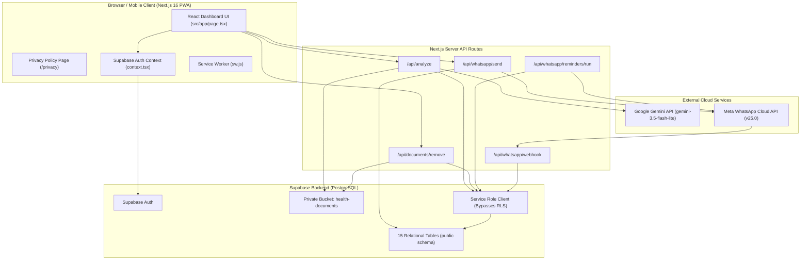
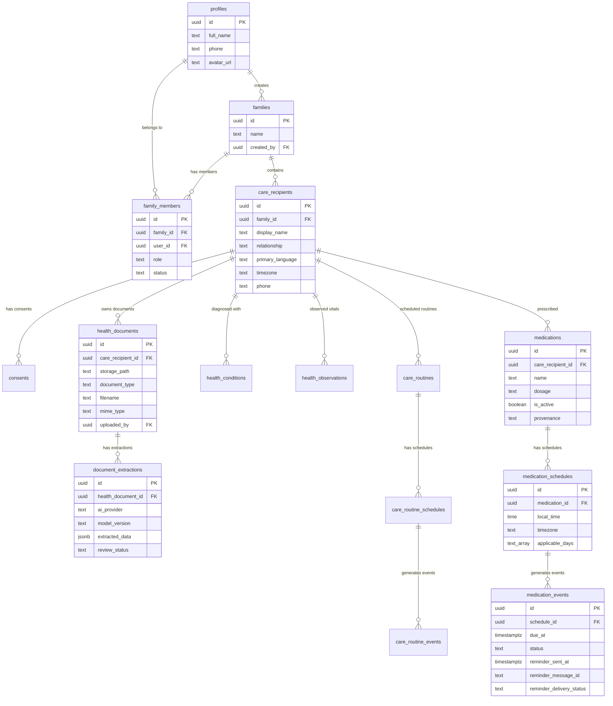
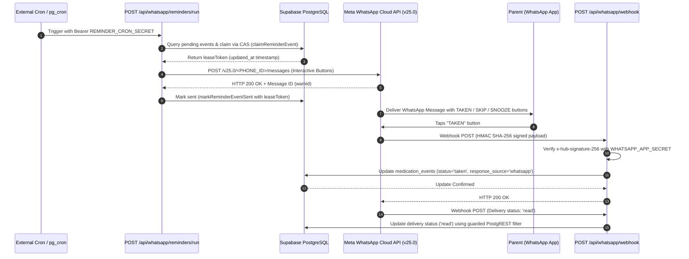

# First Family Care Console (Parents Health OS) — PROJECT TRUTH

Last verified: September 6, 2026
Repository state: `main` @ `a7cc3ba` (`fix: grant WhatsApp event update permissions`)

---

## 1. One-liner

Parents Health OS is a Next.js 16 web application built for adult children and caregivers to coordinate health routines, vitals, medical documents, and automated WhatsApp reminders for elderly parents in India using Supabase PostgreSQL persistence and Google Gemini AI document extraction.

---

## 2. Elevator pitch

Caring for aging parents across cities or busy work schedules creates cognitive load and anxiety for adult children. Parents Health OS provides a calm, centralized family care console where adult children record medications, non-medication care routines, longitudinal vitals, and health documents. To eliminate complex app onboarding for elderly parents, care reminders are dispatched directly to the parent's WhatsApp via the Meta Cloud API with interactive quick-reply buttons (TAKEN, SKIP, SNOOZE, DONE), feeding response status back into the family care log.

---

## 3. What the system actually is

### Scope & Target Users
- **Primary Users:** Adult children and primary caregivers managing elderly parents.
- **Parent Interface:** Zero app installation required. Parents receive structured WhatsApp messages with interactive response buttons in clean E.164 Indian phone format (`+91XXXXXXXXXX`).
- **Application Boundary:** A single-page Next.js web console backed by Supabase Auth, PostgreSQL RLS, Private Storage, Google Gemini AI API (`gemini-3.5-flash-lite`), and Meta WhatsApp Cloud API (`v25.0`).

### Real vs. Simulated Capabilities
- **REAL:** User authentication, family network setup, care recipient registration, medication schedules, care routine schedules, longitudinal vitals/observations, private document upload, Gemini 3.5 Flash-Lite structured document extraction, caregiver extraction review, authenticated document deletion, direct Meta Cloud API WhatsApp reminder dispatch, WhatsApp webhook verification, interactive button callback updates, delivery status lifecycle handling, and Compare-And-Swap (CAS) scheduler concurrency locking.
- **NOT IMPLEMENTED / OUT OF SCOPE:** Live video telemedicine, clinical diagnosis or autonomous AI prescribing, real-time emergency dispatching, or automated continuous bg_cron scheduling inside the repository (requires external cron trigger or Supabase pg_cron setup).

---

## 4. Capability truth matrix

| Capability | UI Implication | Actual Runtime Behaviour | Persistence Destination | External Dependency | Verification Level | Classification |
| :--- | :--- | :--- | :--- | :--- | :--- | :--- |
| **User Auth** | Login form & session state | Supabase Auth via `@supabase/ssr` cookies & Bearer tokens | `auth.users` & `public.profiles` | Supabase Auth | VERIFIED LOCAL & LIVE | REAL |
| **Family Setup** | First family intake screen | Creates family circle & links user as `owner` | `public.families` & `public.family_members` | Supabase Postgres | VERIFIED LOCAL & LIVE | REAL |
| **Care Recipient Mgmt** | Recipient selector & addition form | Adds care recipients with language, phone, timezone | `public.care_recipients` | Supabase Postgres | VERIFIED LOCAL & LIVE | REAL |
| **Medication Tracking** | Med form & adherence cards | Stores medications, schedules, & generates due events | `public.medications`, `medication_schedules`, `medication_events` | Supabase Postgres | VERIFIED LOCAL & LIVE | REAL |
| **Care Routine Tracking** | Routine form & adherence cards | Stores non-medication routines (exercise, hydration, etc.) | `public.care_routines`, `care_routine_schedules`, `care_routine_events` | Supabase Postgres | VERIFIED LOCAL & LIVE | REAL |
| **Health Observations** | Vitals logging modal | Logs blood pressure, glucose, weight, SpO2, symptoms | `public.health_observations` | Supabase Postgres | VERIFIED LOCAL & LIVE | REAL |
| **Health Documents** | File dropzone & document list | Uploads files to private storage bucket | Storage bucket `health-documents` & `public.health_documents` | Supabase Storage | VERIFIED LOCAL & LIVE | REAL |
| **AI Document Extraction** | "Analyze Document" action | Calls Gemini API with structured JSON schema | `public.document_extractions` | Google Gemini API (`gemini-3.5-flash-lite`) | VERIFIED LOCAL & LIVE | REAL |
| **Document Removal** | Trash icon on document card | Purges storage object & deletes DB metadata | Supabase Storage & `public.health_documents` | Supabase Storage / Postgres | VERIFIED LOCAL & LIVE | REAL |
| **Manual WhatsApp Send** | "SEND TEST REMINDER" button | Dispatches Meta Cloud API interactive message | `medication_events` / `care_routine_events` | Meta WhatsApp Cloud API (`v25.0`) | VERIFIED LIVE | REAL |
| **Scheduled Reminders** | System automation | `/api/whatsapp/reminders/run` queries due window with CAS locks | `medication_events` / `care_routine_events` | Meta WhatsApp Cloud API & Cron trigger | VERIFIED BY AUTOMATED TEST | REAL — REQUIRES CONFIGURATION |
| **WhatsApp Webhook** | Automated button response | Receives callback, verifies signature, updates event | `medication_events` / `care_routine_events` | Meta Webhook POST | VERIFIED LIVE | REAL |
| **Delivery Status Tracking** | Status receipts (sent/delivered/read) | Updates status atomically using PostgREST filters | `medication_events` / `care_routine_events` | Meta Webhook POST | VERIFIED BY AUTOMATED TEST & LIVE | REAL |
| **Progressive Web App (PWA)** | Installable web app | Web manifest (`manifest.json`) & network-only Service Worker (`sw.js`) | Local browser cache | Browser PWA engine | VERIFIED LOCAL | REAL |
| **Privacy Policy** | Public `/privacy` link | Publicly readable privacy disclosure page | None (Static Next.js page) | Vercel / Next.js | VERIFIED LOCAL & LIVE | REAL |

---

## 5. System architecture

### Mermaid Architecture Diagram



### Component Responsibility Matrix

| Component | Responsibility | Runtime | Persistence | External Dependency |
| :--- | :--- | :--- | :--- | :--- |
| `src/app/page.tsx` | Dashboard UI, state management, modals, and client actions | Client Browser | React state / Supabase SSR | Supabase Client |
| `src/app/privacy/page.tsx` | Publicly accessible privacy policy disclosure | Client / Server | None | None |
| `src/lib/supabase/context.tsx` | Global authentication and family data provider | Client Browser | Supabase Auth cookies | Supabase Client |
| `src/app/api/analyze/route.ts` | Server-side document analysis via Gemini 3.5 Flash-Lite | Server (Node.js) | `document_extractions` | `@google/genai` API |
| `src/app/api/documents/remove/route.ts` | Authenticated document storage and metadata purge | Server (Node.js) | Storage & `health_documents` | Supabase Admin Client |
| `src/app/api/whatsapp/send/route.ts` | Caregiver-triggered manual reminder dispatch | Server (Node.js) | `medication_events` / `care_routine_events` | Meta Cloud API |
| `src/app/api/whatsapp/reminders/run/route.ts` | Cron-triggered scheduled reminder batch processor | Server (Node.js) | `medication_events` / `care_routine_events` | Meta Cloud API |
| `src/app/api/whatsapp/webhook/route.ts` | Meta verification handshake & inbound button/status handler | Server (Node.js) | `medication_events` / `care_routine_events` | Meta Webhooks |
| `src/lib/whatsapp/service.ts` | WhatsApp dispatch routines & CAS lease locking | Server (Node.js) | Postgres event tables | Meta Cloud API |
| `src/lib/whatsapp/status.ts` | Atomic delivery status transition & PostgREST filter generator | Server (Node.js) | Postgres event tables | PostgREST / Postgres |

---

## 6. Technology stack

- **Framework:** Next.js 16.1.4 (App Router, Turbopack, React Compiler enabled)
- **UI Library:** React 19.2.3, Framer Motion 12.29.0, Lucide React 0.563.0, TailwindCSS v4
- **Database & Auth:** Supabase (`@supabase/supabase-js` v2.106.2, `@supabase/ssr` v0.10.3)
- **AI SDK:** `@google/genai` v2.21.0
- **TypeScript:** TypeScript 5.x (`npx tsc --noEmit` clean)
- **Runtime Environment:** Node.js (v18+), Vercel Serverless

---

## 7. Application surfaces

1. **Landing Page (`/` when unauthenticated):** Brand overview, feature pitch, and "Enter Family Console" action.
2. **Login Screen (`/` mode=`login`):** Email and password authentication via Supabase Auth.
3. **Onboarding Screen (`/` when no care recipients):** First family network creation, parent registration, language selection, and DPDPA permission certification checkbox.
4. **Main Family Dashboard (`/` authenticated):**
   - **Header & Recipient Switcher:** Toggle between multiple registered care recipients (e.g., Amma, Papa).
   - **Home Tab:** Time-based greeting, active reminder timeline (Medications & Care Routines with response buttons), latest vitals summary card, and recent health documents card.
   - **Family Tab:** Family members roster, care recipient profile editor, and "Add Family Member" modal.
   - **Care Tab:** Active medications list, active care routines list, and creation modals for medications and routines.
   - **Records Tab:** Health observations/vitals log with "Log Vitals" modal, diagnostic documents grid with upload dropzone, AI analysis trigger, and safe document removal button.
   - **Profile Tab:** Caregiver account profile, current role display, active family network details, and sign out button.
5. **Public Privacy Policy Page (`/privacy`):** Publicly accessible disclosure covering DPDP Act 2023 compliance, Supabase storage security, Google Gemini extraction scope, and Meta WhatsApp reminder boundaries.

---

## 8. Authentication and identity

- **Authentication Path:** Managed via Supabase Auth using `@supabase/ssr`. Authentication tokens are stored in secure HTTP cookies.
- **User Scoping:** Every user profile is linked to one or more family networks via `public.family_members`.
- **Authorization Roles:**
  - `owner`: Full control over family settings, care recipient profiles, medications, routines, and member invitations.
  - `caregiver`: Can manage care recipients, log vitals, add medications/routines, upload/delete health documents, and dispatch WhatsApp reminders.
  - `viewer`: Read-only access to family health data. Document deletion and database mutations are forbidden.
- **Service-Role Boundary:** Operations requiring administrative access (such as downloading files from private storage or updating event statuses via Webhooks) use `createServiceRoleClient()` which bypasses RLS using `SUPABASE_SECRET_KEY` / `SUPABASE_SERVICE_ROLE_KEY`.

---

## 9. Data model

The canonical database schema is defined across 5 migration files in `supabase/migrations/`. It consists of 15 relational tables in the `public` schema.

> [!NOTE]
> Older project documentation (e.g., `OPERATOR_MANUAL.md`) references a 14-table draft schema with table names like `parents` or `medication_logs`. That documentation is legacy. The 15 tables below represent the exact ground-truth schema in code and applied SQL migrations.

### Mermaid Entity-Relationship Diagram



### Table Reference

1. **`public.profiles`**: Caregiver user profiles linked to `auth.users(id)`. Primary key: `id`.
2. **`public.families`**: Family care networks. Foreign key: `created_by -> profiles.id`.
3. **`public.family_members`**: Link table mapping users to families with roles (`owner`, `caregiver`, `viewer`). Unique constraint: `(family_id, user_id)`.
4. **`public.care_recipients`**: Elderly parent profiles. Contains `display_name`, `relationship`, `primary_language`, `timezone`, `phone`. Foreign key: `family_id -> families.id`.
5. **`public.consents`**: Append-only DPDPA regulatory consent audit log. Foreign key: `care_recipient_id -> care_recipients.id`.
6. **`public.health_documents`**: Medical document file metadata. Storage path references private Supabase bucket `health-documents`. Foreign keys: `care_recipient_id`, `uploaded_by`.
7. **`public.document_extractions`**: Untrusted AI extractions from Gemini. Contains `extracted_data` (JSONB), `review_status` (`pending_review`, `approved`, `rejected`), `model_version` (`gemini-3.5-flash-lite`). Immutable core fields enforced by PostgreSQL trigger `tr_document_extractions_immutability`.
8. **`public.health_conditions`**: Parent diagnoses with provenance tracking (`manual_entry`, `ai_extracted`, `doctor_diagnosed`).
9. **`public.health_observations`**: Longitudinal vitals and symptoms (`blood_pressure`, `blood_glucose`, `weight`, `body_temperature`, `pulse_oximetry`, `heart_rate`, `symptom_notes`). Supports dual-value blood pressure (`value_sys`, `value_dia`).
10. **`public.care_routines`**: Non-medication care activities (exercise, hydration, dietary, etc.).
11. **`public.care_routine_schedules`**: Recurring time rules for care routines.
12. **`public.care_routine_events`**: Idempotent routine execution instances. Contains delivery columns `reminder_sent_at`, `reminder_message_id`, `reminder_delivery_status`. Unique constraint: `(schedule_id, due_at)`.
13. **`public.medications`**: Prescribed medications with dosage instructions and active state.
14. **`public.medication_schedules`**: Recurring time rules for medications.
15. **`public.medication_events`**: Idempotent medication adherence instances. Contains status (`pending`, `taken`, `skipped`, `missed`, `snoozed`) and delivery tracking columns (`reminder_sent_at`, `reminder_message_id`, `reminder_delivery_status`). Unique constraint: `(schedule_id, due_at)`.

---

## 10. Core product flows

### Flow 1: Caregiver Onboarding & Family Registration
`User Sign Up / Login` -> `Check Family Membership` -> `Create Family Network` -> `Register Care Recipient (Parent)` -> `Check DPDPA Consent` -> `Persist in Supabase` -> `Render Dashboard`

### Flow 2: Document Upload, AI Extraction & Safe Purge
`Upload PDF/Image File` -> `Save Object to Private Storage Bucket ('health-documents')` -> `Create Metadata Row in health_documents` -> `Trigger POST /api/analyze` -> `Check Duplicate Extraction` -> `Download Bytes via Service-Role Client` -> `Pass to Google Gemini API (gemini-3.5-flash-lite)` -> `Parse Structured JSON` -> `Insert Pending Row in document_extractions` -> `Display to Caregiver for Approval/Rejection` -> `Optional Purge via POST /api/documents/remove`

### Flow 3: Manual WhatsApp Reminder Dispatch
`Caregiver Clicks 'SEND TEST REMINDER'` -> `POST /api/whatsapp/send` -> `Authenticate Caregiver & Check Family Role` -> `Resolve Care Recipient Phone` -> `Format E.164 (+91XXXXXXXXXX)` -> `Build Interactive Button Payload (med:<uuid>:taken|skipped|snoozed)` -> `POST to Meta Graph API v25.0` -> `Receive Message ID` -> `Update reminder_delivery_status = 'sent'` -> `Return UI Confirmation`

### Flow 4: WhatsApp Button Click Callback & State Update
`Parent Taps 'TAKEN' Button in WhatsApp` -> `Meta Dispatches Webhook POST /api/whatsapp/webhook` -> `Verify HMAC SHA-256 Signature` -> `Extract Button Payload (med:<event_uuid>:taken)` -> `Execute Idempotent Update via Service Role Client` -> `Set status = 'taken', responded_at = NOW(), response_source = 'whatsapp'` -> `Real-time UI Sync via Supabase Subscription`

---

## 11. Health data and care coordination

- **Vitals Tracking:** Structured logging for Blood Pressure (Systolic/Diastolic in mmHg), Blood Glucose (mg/dL), Weight (kg), Temperature (°F), SpO2 (%), Pulse (bpm), and free-text symptom notes.
- **Medications:** Managed through name, dosage (e.g., "500mg"), instructions (e.g., "After breakfast"), local time, and applicable days.
- **Care Routines:** Non-pharmacological routines categorized under exercise, physiotherapy, hydration, dietary, respiratory, sleep, and hygiene.
- **Care Coordination:** All observations, medications, and routine responses are scoped strictly to the selected care recipient, creating a clean chronological history for family review.

---

## 12. Document ingestion and extraction

1. **Upload:** Files are uploaded directly from the browser to the private Supabase storage bucket `health-documents` under paths like `<care_recipient_id>/<filename>`.
2. **Database Lineage:** Metadata is saved in `public.health_documents`.
3. **Extraction Processing (`/api/analyze`):**
   - Verified active family membership before processing.
   - Idempotency guard: If an extraction with status `pending_review` or `approved` already exists, the route reuses the existing extraction without calling Gemini.
   - Document bytes are downloaded server-side using the admin client.
   - Base64-encoded document bytes are passed to the official `@google/genai` SDK using `gemini-3.5-flash-lite`.
   - Strict JSON Schema enforcement via `responseSchema` extracts `document_type`, `document_date`, `provider_or_hospital`, `medications`, `conditions`, `measurements`, `follow_up_instructions`, `summary`, and `uncertainties`.
   - Result saved in `public.document_extractions` with status `pending_review`.
4. **Purge (`/api/documents/remove`):** Caregivers can delete documents. The route purges the private storage object first, followed by deleting the `health_documents` database row (which cascades deletion to `document_extractions`).

---

## 13. AI / model architecture

- **Provider:** Google Gemini API
- **SDK:** `@google/genai` v2.21.0
- **Model Identifier:** `gemini-3.5-flash-lite`
- **Invocation Site:** `src/app/api/analyze/route.ts`
- **Configuration:** Structured JSON response contract (`responseMimeType: "application/json"`), `responseSchema` built using GenAI `Type` definitions.
- **Clinical Safety Mandate:** The prompt explicitly mandates:
  1. NEVER diagnose, prescribe, or suggest medication adjustments.
  2. NEVER infer facts not explicitly supported by the document.
  3. Objective, calm, and non-alarmist summary wording.
- **Fallback Behaviour:** If JSON parsing fails, the raw text is preserved under summary with an uncertainty flag indicating manual review is required.

---

## 14. WhatsApp reminder and delivery system

### Technical Architecture

- **API Endpoint:** Meta WhatsApp Cloud API (Graph API `v25.0`).
- **Base URL:** `https://graph.facebook.com/v25.0/<WHATSAPP_PHONE_NUMBER_ID>/messages`
- **Phone Number Normalization:** Standardized to E.164 format (`+91XXXXXXXXXX`) via `formatIndianPhoneNumber`. Leading `+` is stripped for Meta API payloads (`91XXXXXXXXXX`).
- **Privacy Masking:** Phone numbers in logs are masked via `maskPhoneNumber` (e.g., `+91••••••3210`).

### Interactive Button Message Payload Format

Outbound reminders dispatch interactive reply buttons with deterministic callback IDs:
- **Medications:** `med:<medication_event_uuid>:taken` | `med:<medication_event_uuid>:skipped` | `med:<medication_event_uuid>:snoozed`
- **Care Routines:** `routine:<care_routine_event_uuid>:completed` | `routine:<care_routine_event_uuid>:skipped` | `routine:<care_routine_event_uuid>:snoozed`

### Webhook Verification & Event Lifecycle

1. **Verification (GET):** Meta verification handshake checks `hub.mode === "subscribe"` and `hub.verify_token === WHATSAPP_VERIFY_TOKEN`.
2. **Signature Authentication (POST):** Every webhook POST is authenticated by verifying `x-hub-signature-256` HMAC SHA-256 using `WHATSAPP_APP_SECRET`.
3. **Delivery Status Receipts:** Meta sends delivery updates (`sent`, `delivered`, `read`, `failed`). Route passes status receipts to `handleWhatsAppDeliveryStatusUpdate` in `src/lib/whatsapp/status.ts`.
4. **Atomic Status Guarding:** `getGuardedStatusUpdateFilter` generates PostgREST filters ensuring out-of-order webhooks cannot downgrade states (e.g., late `delivered` cannot overwrite `read`).

### Compare-And-Swap (CAS) Scheduler Concurrency Locking

The scheduler route (`/api/whatsapp/reminders/run`) implements atomic Compare-And-Swap (CAS) locking:
1. **Claim (`claimReminderEvent`):** Atomically updates `reminder_delivery_status = 'pending'` on unclaimed events (`reminder_sent_at IS NULL`) within the 15-minute due window (-2 hours to +15 minutes) and returns the new `updated_at` timestamp as a CAS `leaseToken`.
2. **Release (`releaseReminderEventClaim`):** If Meta API dispatch fails pre-acceptance, restores `reminder_delivery_status = null` using `leaseToken` match.
3. **Mark Sent (`markReminderEventSent`):** Upon receiving `messageId` from Meta API, sets `reminder_sent_at = NOW()`, `reminder_message_id`, and `reminder_delivery_status = 'sent'` using `leaseToken` match.
4. **Stale Lease Recovery:** If a worker crashes while holding a lease, leases older than 5 minutes (`STALE_LEASE_MS`) are automatically eligible for reclamation by subsequent scheduler runs.

### Sequence Diagram



### Defect History & Resolved Fixes

1. **WhatsApp Recipient Lookup Defect:** Initial manual send failed with "Care recipient profile not found" because UI passed `careRecipientId` while the backend expected different parameter keys or user RLS client failed lookup.
   - *Fix (Commit `4cb4e60`):* Hardened parameter parsing to support `careRecipientId`, `care_recipient_id`, and `recipientId` and added service-role lookup fallback.
2. **Meta Cloud API Version Alignment:** Repository had `GRAPH_API_VERSION = "v26.0"`, but Meta Developer Dashboard runs `v25.0`.
   - *Fix (Commit `2fc85c8`):* Centralized `GRAPH_API_VERSION` updated to `v25.0`.
3. **Database Permission Defect:** WhatsApp Webhook failed to update medication event status on button callbacks with error `permission denied for table medication_events`.
   - *Fix (Commit `a7cc3ba`):* Added migration `20260906140000_grant_whatsapp_events_service_role.sql` granting `SELECT, UPDATE` on `medication_events` and `care_routine_events` to `service_role`.

---

## 15. Security and privacy

- **Auth Bounds:** Row-Level Security (RLS) enabled on all 15 public schema tables.
- **Server Safety Guards:** `assertServerOnly` prevents server-only credentials from leaking to browser bundles. `assertNotForbiddenProject` prevents accidental connections to unauthorized Supabase project references.
- **Privacy Policy:** Published at `/privacy` in compliance with Meta Cloud API verification and India's Digital Personal Data Protection (DPDP) Act 2023.
- **Sensitive Data Handling:** Document files stored in non-public private storage buckets. Phone numbers masked in logs (`maskPhoneNumber`).

---

## 16. Failure handling

- **Database Disconnection:** Supabase client returns standard error objects; UI displays toast alerts without crashing.
- **AI Extraction Errors:** `/api/analyze` catches API exceptions and falls back to manual review status. Duplicate call protection reuses existing extractions.
- **WhatsApp Dispatch Failures:** Meta API errors (e.g. invalid token, expired session) return HTTP 502 with descriptive message. CAS locks release claimed events for retry.
- **Out-of-Order Webhooks:** `status.ts` uses state transition matrices and PostgREST filters to ignore duplicate or out-of-order status receipts (e.g. `delivered` after `read`).
- **Free-text WhatsApp Messages:** Non-button messages are logged safely without invoking an automated AI chatbot, preventing hallucinated medical advice.

---

## 17. Tests and verification

### Verification Inventory

| Area | Test / Script | What It Proves | Result | What Remains Unproven |
| :--- | :--- | :--- | :--- | :--- |
| **WhatsApp Delivery Atomicity** | `scripts/test-delivery.ts` | Validates status transition rules, duplicate handling, PostgREST filter string generation, and race condition resistance | **PASSED (12/12 tests)** | Requires live Meta webhook to verify production network latency |
| **Scheduler Concurrency & CAS** | `scripts/test-scheduler.ts` | Validates CAS lease claims, stale worker rejection, lease reclamation, and idempotent failure release | **PASSED (10/10 tests)** | Requires multi-region serverless load testing |
| **TypeScript Type Safety** | `npx tsc --noEmit` | Compiles codebase without type errors | **PASSED (0 errors)** | N/A |
| **Production Build** | `npm run build` | Compiles Next.js routes, server components, and static pages with Turbopack | **PASSED (Clean build)** | N/A |
| **Git Line Endings / Whitespace** | `git diff --check` | Confirms clean formatting and line endings | **PASSED (Clean)** | N/A |

---

## 18. Runtime and deployment truth

- **Repository Readiness:** Codebase compiles cleanly, all automated tests pass, and Next.js production build succeeds.
- **Local Execution:** Fully functional using `npm run dev` with `.env.local` configured.
- **Required Environment Variables:** `GEMINI_API_KEY`, `NEXT_PUBLIC_SUPABASE_URL`, `NEXT_PUBLIC_SUPABASE_PUBLISHABLE_KEY`, `SUPABASE_SECRET_KEY`, `WHATSAPP_PHONE_NUMBER_ID`, `WHATSAPP_BUSINESS_ACCOUNT_ID`, `WHATSAPP_ACCESS_TOKEN`, `WHATSAPP_VERIFY_TOKEN`, `WHATSAPP_APP_SECRET`, `REMINDER_CRON_SECRET`.
- **Live Deployment Status:** Deployment ready for Vercel. Meta Cloud API app is Live/Published and verified against WABA.
- **Applied Database Migrations:** All 5 migrations in `supabase/migrations/` must be applied to the target Supabase project SQL Editor.

---

## 19. Environment variables and external configuration

```bash
# GEMINI AI SDK Key
GEMINI_API_KEY=your_gemini_api_key_here

# SUPABASE PARENTS HEALTH OS PROJECT
NEXT_PUBLIC_SUPABASE_URL=https://your-project-ref.supabase.co
NEXT_PUBLIC_SUPABASE_PUBLISHABLE_KEY=your_publishable_key_here
SUPABASE_SECRET_KEY=your_secret_service_role_key_here

# META WHATSAPP CLOUD API (v25.0)
WHATSAPP_PHONE_NUMBER_ID=your_phone_number_id_here
WHATSAPP_BUSINESS_ACCOUNT_ID=your_waba_id_here
WHATSAPP_ACCESS_TOKEN=your_permanent_system_user_token_here
WHATSAPP_VERIFY_TOKEN=your_webhook_verify_token_here
WHATSAPP_APP_SECRET=your_meta_app_secret_here

# SCHEDULER SECURITY
REMINDER_CRON_SECRET=your_cron_secret_here

# META APPROVED TEMPLATES (OPTIONAL)
WHATSAPP_MEDICATION_TEMPLATE=
WHATSAPP_ROUTINE_TEMPLATE=
```

---

## 20. Known limitations

1. **Cron Automation Trigger:** The repository contains `/api/whatsapp/reminders/run` and `supabase/drafts/whatsapp_cron_schedule.sql`, but automatic invocation relies on an external cron service (e.g. Vercel Cron) or executing the draft `pg_cron` script in Supabase.
2. **Single-Page / Image PDF Constraints:** Document extraction via Gemini processes single documents uploaded as PDF, PNG, JPEG, or WebP up to 20MB.
3. **No Automated Free-Text AI Chatbot:** Free-text WhatsApp messages are logged without automated AI responses to preserve clinical safety.

---

## 21. Known technical debt

1. **Stale Documentation File:** `OPERATOR_MANUAL.md` contains legacy references to an older 14-table draft schema and local sandbox browser mode. It should be updated or archived in future cleanup.
2. **Next.js Middleware Deprecation Warning:** Next.js 16 emits a non-fatal build warning indicating that the `middleware` file convention is deprecated in favor of `proxy`.

---

## 22. Repository map

```
parents-health-os/
├── .env.example
├── next.config.ts
├── package.json
├── OPERATOR_MANUAL.md (Legacy documentation)
├── PROJECT_TRUTH_parentshealthos.md (Ground truth document)
├── public/
│   ├── manifest.json (PWA Web Manifest)
│   ├── sw.js (Network-Only Service Worker)
│   └── icons/
├── scripts/
│   ├── test-delivery.ts (Delivery status test runner)
│   ├── test-scheduler.ts (Scheduler concurrency test runner)
│   └── generate-icons.js
├── src/
│   ├── middleware.ts (Supabase session update middleware)
│   ├── app/
│   │   ├── layout.tsx
│   │   ├── page.tsx (Main Family Dashboard Console)
│   │   ├── privacy/page.tsx (Public Privacy Policy)
│   │   └── api/
│   │       ├── analyze/route.ts (Gemini 3.5 Flash-Lite Document Intelligence)
│   │       ├── documents/remove/route.ts (Authenticated Document & Storage Purge)
│   │       └── whatsapp/
│   │           ├── reminders/run/route.ts (Scheduler Batch Dispatcher)
│   │           ├── send/route.ts (Manual Reminder Dispatcher)
│   │           └── webhook/route.ts (Meta Webhook Verification & Callback)
│   ├── components/ (Dashboard sub-components & UI Toast)
│   └── lib/
│       ├── supabase/ (Supabase server, client, admin, middleware, context, & types)
│       └── whatsapp/
│           ├── client.ts (Meta Graph API v25.0 message dispatcher & E.164 formatter)
│           ├── config.ts (Centralized WhatsApp config & Graph API v25.0 constant)
│           ├── service.ts (Reminder builders & CAS lease claim/release functions)
│           ├── status.ts (Atomic delivery status transition logic & PostgREST filters)
│           └── __tests__/ (Automated test suites for delivery and scheduler)
└── supabase/
    ├── config.toml
    ├── drafts/whatsapp_cron_schedule.sql
    └── migrations/
        ├── 20260903120000_create_v1_schema.sql (15-table relational schema & RLS)
        ├── 20260903130000_create_health_documents_storage_bucket.sql (Private bucket)
        ├── 20260904001000_grant_document_extractions_service_role.sql
        ├── 20260904010000_add_whatsapp_reminder_delivery_columns.sql
        └── 20260906140000_grant_whatsapp_events_service_role.sql
```

---

## 23. Final ground-truth summary

| Area | Current State | Evidence | Remaining Caveat |
| :--- | :--- | :--- | :--- |
| **Authentication & Auth** | Real Supabase Auth & RLS across 15 tables | `src/lib/supabase/context.tsx` & Migration `20260903120000_create_v1_schema.sql` | Users must sign in to access family console |
| **Data Persistence** | Real PostgreSQL database persistence | 15 tables created in SQL migrations | Tables must be migrated to live Supabase project |
| **Document Intelligence** | Gemini 3.5 Flash-Lite extraction with strict JSON schema | `src/app/api/analyze/route.ts` using `@google/genai` | Requires valid `GEMINI_API_KEY` |
| **Document Deletion** | Safe storage purge & DB metadata cascade | `src/app/api/documents/remove/route.ts` | Restricted to caregiver/owner roles |
| **WhatsApp Dispatches** | Direct Meta Cloud API Graph API `v25.0` with interactive buttons | `src/lib/whatsapp/client.ts` & `config.ts` | Requires Meta Cloud API credentials |
| **WhatsApp Webhooks** | HMAC SHA-256 signature verification & button status updates | `src/app/api/whatsapp/webhook/route.ts` & `status.ts` | Requires Meta Webhook configuration |
| **WhatsApp Permissions** | Least-privilege `SELECT, UPDATE` granted to `service_role` | Migration `20260906140000_grant_whatsapp_events_service_role.sql` | Migration must be applied to live database |
| **Scheduler Concurrency** | CAS lease locking with 5-minute stale recovery | `src/lib/whatsapp/service.ts` & `reminders/run/route.ts` | Automated runs require external cron call |
| **Automated Tests** | 100% Passing (Delivery & Scheduler test suites) | `scripts/test-delivery.ts` & `scripts/test-scheduler.ts` | Automated unit/concurrency tests pass |
| **Build & Type Check** | Clean build & 0 TypeScript errors | `npx tsc --noEmit` & `npm run build` | Verified clean |
